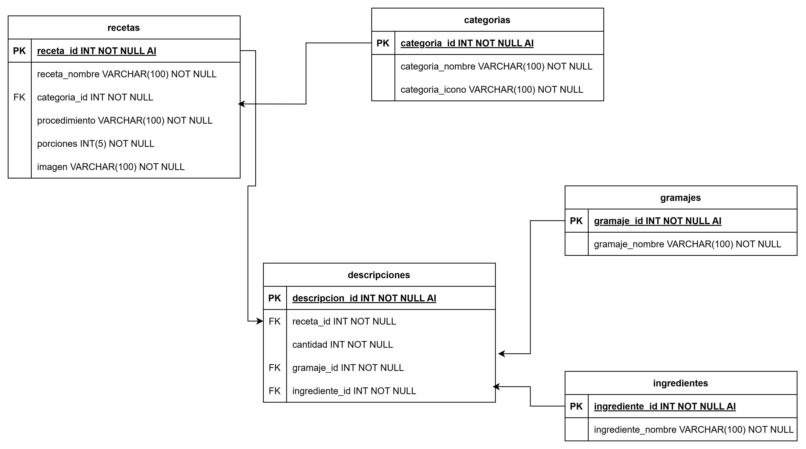

# Proyecto: API REST - Recetas

### Descripción:

Proyecto de creación de API REST para el proyecto de recetas en linea, utilizando Mysql y Node.js con el framework express.

**Diagrama de entidades de la base de datos:**

**Reglas de negocio:**

* Mostrar las 6 recetas más recientes(Nombre e imagen)
* Mostrar las categorías que existen (Nombre e icono)
* Mostrar recetas por cada categoría (Nombre e imagen)
* Mostrar la receta detallada de cada una de las recetas que están registradas (Nombre, ingredientes, procedimiento, imagen, porciones)

**Vista previa del proyecto:**

### Recursos

* Diagrama en [draw.io](https://app.diagrams.net/)
* Despliegue en [Railway](https://railway.app/)
* Iconos en [tabler ICONS](https://tabler.io/icons)
* Imagenes en [lummi](https://www.lummi.ai/)
* Colores en [color hunt](https://colorhunt.co/)

